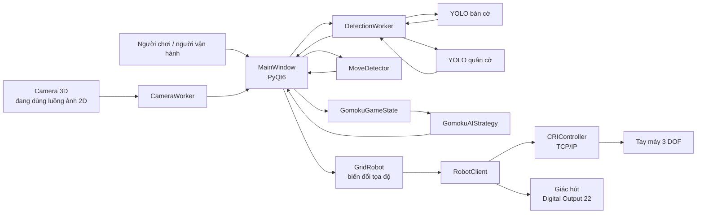
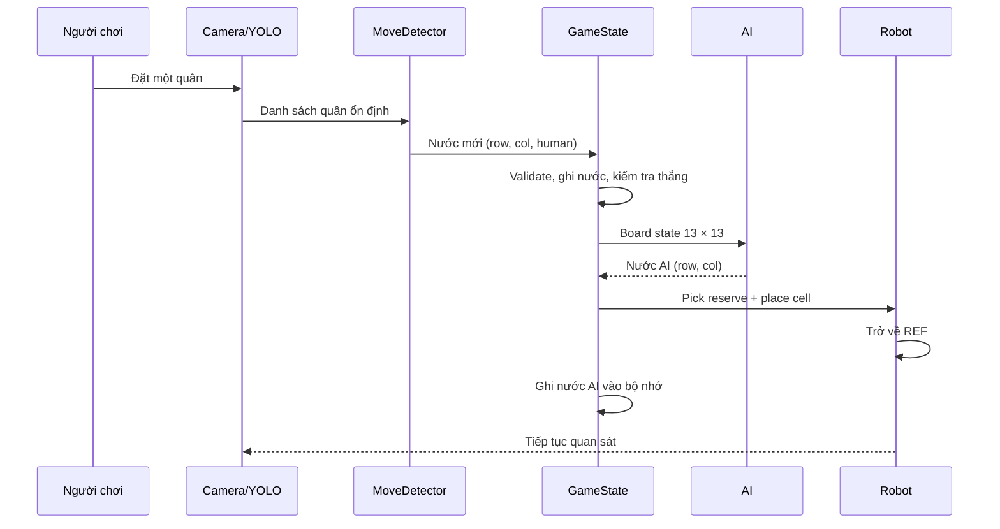

# Mô tả chi tiết hệ thống robot chơi cờ Gomoku hiện tại

**Phiên bản tài liệu:** 1.0  
**Ngày đối chiếu:** 17-09-2026  
**Nhánh mã nguồn:** `vuvananh_intergration`  
**Commit được đối chiếu:** `685a5df`  
**Chương trình chính:** `caro_gui2.py`

## 1. Mục đích và phạm vi tài liệu

Tài liệu này mô tả trạng thái **đang có trong repository** của hệ thống robot chơi cờ Gomoku, từ thu nhận ảnh, nhận diện bàn cờ và quân cờ, quản lý ván đấu, chọn nước đi, chuyển đổi tọa độ đến điều khiển tay máy và giác hút.

Tài liệu phân biệt hai loại thông tin:

- **Được xác nhận từ mã nguồn:** hành vi có thể truy ra từ các file Python và dữ liệu calibration trong repository.
- **Được người phát triển xác nhận:** cấu hình phần cứng thực tế nhưng chưa được biểu diễn đầy đủ trong mã nguồn.

Các tài liệu cũ như `FLOW_DIAGRAM.md` và `INTEGRATION_PLAN.md` được dùng để tham khảo ý định thiết kế. Khi chúng khác với mã nguồn hiện tại, tài liệu này ưu tiên hành vi của `caro_gui2.py` và các module mà file đó đang gọi.

## 2. Tóm tắt hệ thống

Hệ thống hiện tại là một robot chơi Gomoku 13 × 13 có khả năng:

- quan sát bàn cờ qua camera;
- dùng hai mô hình YOLO để tìm bàn cờ và phân loại quân;
- ánh xạ tâm quân cờ từ ảnh sang ô `(row, col)`;
- phát hiện một nước đi mới của người;
- quản lý lượt chơi và điều kiện năm quân liên tiếp;
- chọn nước đi cho AI bằng Minimax hoặc một adapter AlphaZero;
- lấy quân AI từ khay dự trữ bằng giác hút;
- đặt quân vào giao điểm tương ứng trên bàn cờ;
- trở về tư thế tham chiếu để camera tiếp tục quan sát.

Luồng tự động chính là:

```text
Camera
  → nhận diện bàn cờ và quân cờ
  → ánh xạ ảnh sang lưới 13 × 13
  → phát hiện nước mới của người
  → cập nhật trạng thái ván cờ
  → AI chọn nước đi
  → đổi ô cờ sang tọa độ robot
  → lấy quân từ khay
  → đặt quân
  → robot về tư thế quan sát
  → tiếp tục nhận diện
```

## 3. Phần cứng hiện có

### 3.1. Thành phần được người phát triển xác nhận

| Thành phần | Trạng thái hiện tại |
|---|---|
| Tay máy | Tay máy robot 3 DOF |
| Camera | Camera 3D gắn trên đầu tay máy, tức cấu hình eye-in-hand |
| Tư thế quan sát | Camera ban đầu được đưa tới một vị trí cố định để quan sát toàn bàn cờ |
| Cơ cấu gắp | Giác hút chân không |
| Phản hồi giác hút | Không có cảm biến áp suất/chân không; phần mềm chỉ bật hoặc tắt đầu ra hút |
| Nền tảng tính toán có sẵn | PC, Raspberry Pi 3 và Jetson NX |

### 3.2. Mức độ sử dụng phần cứng trong code hiện tại

- `caro_gui2.py` mở camera bằng `cv2.VideoCapture(CAMERA_INDEX)` với `CAMERA_INDEX = 0`.
- Pipeline hiện chỉ lấy ảnh màu dạng OpenCV. Chưa có code đọc depth map, point cloud hoặc API riêng của camera 3D.
- File `calibration/intrinsics.npz` có thông số nội tại camera nhưng chưa được gọi trong pipeline chính.
- File `calibration/perspective.npz` có ma trận phối cảnh nhưng cũng chưa được gọi trong pipeline chính.
- Repository chưa có cơ chế phân chia rõ nhiệm vụ giữa PC, Pi 3 và Jetson NX. Từ góc nhìn phần mềm, đây vẫn là một ứng dụng Python chạy trên một máy và kết nối tới bộ điều khiển robot qua mạng.
- Tay máy được điều khiển qua tọa độ Cartesian `X, Y, Z, A, B, C`. Các góc `A, B, C` chủ yếu được giữ cố định trong chu trình gắp–đặt.

## 4. Kiến trúc tổng thể



`MainWindow` trong `caro_gui2.py` đang đóng vai trò bộ điều phối trung tâm. GUI vừa nhận kết quả từ các worker, vừa giữ trạng thái game, gọi AI và thực thi chuỗi lệnh robot.

## 5. Các module chính

| File/module | Vai trò thực tế |
|---|---|
| `caro_gui2.py` | Entry point, GUI, camera thread, detection thread, game loop, AI turn và điều khiển robot |
| `gomoku_game_state.py` | Bàn cờ logic, kiểm tra lượt, lịch sử nước đi, thắng/thua/hòa |
| `move_detector.py` | So sánh hai tập detection liên tiếp để tìm đúng một vị trí mới |
| `gomoku_ai_strategy.py` | Adapter chung cho Minimax/Alpha–Beta và AlphaZero/MCTS |
| `grid_actions.py` | Đổi `(row, col)` sang tọa độ bàn và tọa độ robot; API robot cấp lưới |
| `robot_client.py` | Chuỗi chuyển động gắp–đặt, điều khiển chân không và lấy quân từ khay |
| `cri_lib/cri_controller.py` | Giao tiếp TCP với igus Robot Control bằng CRI protocol |
| `cri_lib/cri_protocol_parser.py` | Phân tích gói trạng thái/phản hồi CRI |
| `cri_lib/robot_state.py` | Các cấu trúc trạng thái khớp, Cartesian, I/O, lỗi và kinematics |
| `teach_reserve_point.py` | Ghi tư thế hiện tại của robot thành điểm lấy quân dự trữ |
| `calibration/*.npz` | Dữ liệu calibration camera, phối cảnh, bàn cờ–robot và điểm khay |

## 6. Khởi động ứng dụng

Khi chạy `python3 caro_gui2.py`, chương trình thực hiện các bước sau:

1. Import PyQt6, OpenCV, NumPy, Torch, Ultralytics và các module nội bộ.
2. Kiểm tra import YOLO; nếu lỗi thì đặt `_YOLO_AVAILABLE = False`.
3. Tạo `QApplication` và `MainWindow`.
4. Khởi tạo trạng thái game, move detector và AI strategy.
5. Tạo hai `QThread`: `CameraWorker` và `DetectionWorker`.
6. Khởi động `CameraWorker` tự động sau khi giao diện được dựng.
7. `DetectionWorker` chỉ thật sự suy luận khi người vận hành bấm **Start Detect** hoặc **Start Game**.
8. Kết nối robot chỉ được tạo khi bấm **Connect Robot**.

### 6.1. Lưu ý về trạng thái khởi tạo

- Bàn cờ logic được reset về rỗng.
- Người chơi luôn đi trước: `current_turn = HUMAN_PLAYER`.
- `auto_play_mode` mặc định là `True`.
- `game_active` được đặt thành `True` ngay khi khởi tạo/reset, dù chưa bấm Start Game.
- GUI mặc định hiển thị lựa chọn Minimax, và `_configure_ai_strategy()` ban đầu cũng tạo Minimax depth 1.

## 7. Giao diện điều khiển

### 7.1. Thanh công cụ

Các chức năng đang có:

- **Connect Robot:** kết nối bộ điều khiển robot.
- **Start Detect / Stop Detect:** bật hoặc tắt suy luận YOLO.
- **Place…:** chọn thủ công một ô và yêu cầu robot đặt quân.
- **Go REF:** đưa robot về tư thế tham chiếu.
- **Virtual Play:** chơi Gomoku với AI trên bàn cờ ảo, không cần robot/camera.
- **Start Game / Stop Game / Reset Board:** điều khiển vòng đời ván cờ.
- **Auto Play:** bật phản ứng tự động sau khi phát hiện nước của người.
- **AI selector:** Minimax hoặc AlphaZero.
- **Strength selector:** Minimax depth 1, 2 hoặc 3.

### 7.2. Khu vực hiển thị

- Khung camera hiển thị ảnh gốc hoặc ảnh đã vẽ ROI, vị trí quân và tọa độ lưới.
- Bảng 13 × 13 hiển thị trạng thái logic của game, không trực tiếp hiển thị toàn bộ trạng thái detection mới nhất.
- Nhãn robot hiển thị ô vừa đặt và tọa độ `X, Y` trong hệ base.
- Status bar hiển thị trạng thái camera, detection, robot, lượt chơi và lỗi mức giao diện.

### 7.3. Ba chế độ sử dụng thực tế

1. **Auto Play:** camera phát hiện nước người, AI tính nước và robot tự đặt quân.
2. **Manual Place:** người vận hành chọn ô, robot lấy quân từ khay và đặt vào ô đó.
3. **Virtual Play:** kiểm thử logic game/AI hoàn toàn trong GUI.

Manual Place hiện không ghi nước đi đó vào `GomokuGameState`; nó chủ yếu là chức năng điều khiển robot thủ công.

## 8. Pipeline camera và xử lý ảnh

### 8.1. Thu nhận ảnh

`CameraWorker`:

- mở camera index 0 bằng OpenCV;
- đọc frame liên tục trong một thread riêng;
- copy frame trước khi phát Qt signal `newFrame`;
- giải phóng camera khi thread dừng hoặc gặp lỗi.

Frame mới được lưu vào `MainWindow.last_frame`. Khi detection đang bật và không bị freeze, frame được chuyển tiếp cho `DetectionWorker`.

### 8.2. Hai mô hình YOLO

Detection dùng hai model:

- model bàn cờ: tìm bounding box của toàn bàn;
- model quân cờ: phát hiện hai loại quân bên trong ROI.

Các đường dẫn hiện được hard-code trong `caro_gui2.py`:

```text
BOARD_MODEL_PATH = D:/1/code1/lastbc.pt
PIECE_MODEL_PATH = D:/1/code1/last.pt
RUNS_DIR = D:/1/code1/runs
```

Đây là đường dẫn Windows và không tồn tại trong repository Linux hiện tại. Model weight cũng không có trong danh sách file của repository.

### 8.3. Phát hiện và khóa ROI bàn cờ

Quy trình tìm ROI:

1. Chạy model bàn cờ trên toàn frame.
2. Nếu không có box, trả về trạng thái `NO BOARD`.
3. Nếu có nhiều box, chọn box có diện tích lớn nhất.
4. Thu nhỏ box theo `SHRINK_FACTOR = 0.99`.
5. Lưu thành `fixed_roi`.
6. Khi `enable_roi_lock = True`, mọi frame sau dùng lại ROI đã khóa và không phát hiện lại vị trí bàn.

ROI khóa giúp giảm rung tọa độ nhưng giả định camera và bàn cờ không dịch chuyển sau lần phát hiện đầu tiên.

### 8.4. Phát hiện quân và ánh xạ sang ô cờ

Model quân được chạy trên crop của ROI với ngưỡng:

```text
CONF_PIECE = 0.35
```

Với mỗi bounding box:

1. Tính tâm `(cx, cy)` trong crop.
2. Đổi thành pixel tuyệt đối `(u, v)` trên frame.
3. Chia chiều rộng và chiều cao ROI thành 12 khoảng giữa 13 giao điểm.
4. Làm tròn tới giao điểm gần nhất.
5. Clamp row/column vào `[0, 12]`.
6. Map class YOLO `0 → HUMAN_PLAYER (1)`, mọi class khác → `AI_PLAYER (2)`.

`DetectionItem` hiện lưu:

```text
row, col, cls_id, u, v
```

Confidence của từng detection không được giữ lại sau bước threshold.

### 8.5. Chống detection trùng và lọc thời gian

Hai bước hậu xử lý đang có:

- `_merge_close_points()` gom các tâm cách nhau dưới 8 pixel và lấy tâm trung bình; class/row/col lấy từ phần tử đầu cluster.
- `_temporal_filter()` giữ history tối đa 10 lần xử lý và, khi đã đủ history, chỉ trả detection xuất hiện trong cả 10 lần.

Trong 9 lần đầu, filter trả trực tiếp detection của lần hiện tại. Biến `DETECTION_STABILITY_FRAMES = 3` được khai báo nhưng không được dùng bởi filter này.

`DetectionWorker` liên tục xử lý bản copy của `_last_frame`; nó chưa gắn sequence number hoặc timestamp cho frame. Vì vậy nhiều lần suy luận có thể dùng lại cùng một frame nếu camera chưa cập nhật ảnh mới.

## 9. Phát hiện nước đi của người

Hệ thống duy trì hai biểu diễn bàn cờ:

- **Detection board:** dựng tạm thời từ các quân camera đang thấy.
- **Game board:** trạng thái logic trong `GomokuGameState`, được coi là nguồn sự thật của ván cờ.

Camera không ghi đè trực tiếp game board. `MoveDetector` tạo map:

```text
(row, col) → cls_id
```

và so sánh map hiện tại với map detection trước đó.

Kết quả có bốn trạng thái:

- `NO_CHANGE`: không xuất hiện vị trí mới;
- `NEW_MOVE`: xuất hiện đúng một vị trí mới;
- `MULTIPLE_NEW`: có hơn một vị trí mới;
- `INVALID`: có tọa độ hoặc class không hợp lệ.

Chỉ `NEW_MOVE` có `cls_id == HUMAN_PLAYER` mới được chuyển tới `_process_human_move()`.

### 9.1. Chặn ảnh bị che

Trước khi gọi `MoveDetector`, GUI so sánh:

- số quân đã biết trong game board;
- số quân camera đang nhìn thấy.

Frame bị bỏ qua khi:

```text
detected_piece_count < known_piece_count
```

hoặc:

```text
detected_piece_count > known_piece_count + 1
```

Mục tiêu là tránh xử lý khi tay người/robot che bàn hoặc detection nhảy quá nhiều.

## 10. Quản lý trạng thái ván cờ

`GomokuGameState` dùng ma trận NumPy `13 × 13`, kiểu `int8`:

| Giá trị | Ý nghĩa |
|---:|---|
| 0 | Ô trống |
| 1 | Người chơi |
| 2 | AI/robot |

Module lưu thêm:

- `last_board_state`;
- `current_turn`;
- `move_history` dưới dạng `(row, col, player)`;
- `game_status`;
- `total_moves`.

Một nước hợp lệ khi:

- row và col nằm trong lưới;
- ô đang trống;
- `player == current_turn`.

Sau `make_move()`, hệ thống cập nhật ô, thêm lịch sử, tăng tổng số nước và đổi lượt.

Điều kiện thắng là tồn tại ít nhất 5 quân liên tiếp theo một trong bốn hướng:

- ngang;
- dọc;
- chéo chính;
- chéo phụ.

Nếu không ai thắng và bàn đầy, trạng thái là hòa.

## 11. AI chọn nước đi

`GomokuAIStrategy` cung cấp cùng một API:

```python
row, col = ai_strategy.get_best_move(board_state, player=AI_PLAYER)
```

### 11.1. Minimax/Alpha–Beta

Trước khi search, AI có hai kiểm tra nhanh:

1. Có nước giúp AI thắng ngay hay không.
2. Nếu không, người có nước thắng ngay hay không để AI chặn.

Sau đó AI chạy Minimax với Alpha–Beta pruning ở depth 1, 2 hoặc 3. Search duyệt toàn bộ ô trống theo thứ tự row-major. Leaf được đánh giá bằng:

```text
heuristic_score(AI) - heuristic_score(HUMAN)
```

Evaluator được import từ:

```text
algorithm_AI_trainning.python.Gomoku_heuristic_minimax.GomokuHeuristic
```

Module này không có trong checkout hiện tại, nên `gomoku_ai_strategy.py` chưa import được trong môi trường repository đang kiểm tra.

### 11.2. AlphaZero/MCTS

Nhánh AlphaZero dự kiến:

- tạo `GomokuEnv` kích thước 13 × 13;
- tạo mạng 10 residual blocks, 40 filters, 80 fully-connected units;
- ưu tiên CUDA, sau đó MPS, rồi CPU;
- dùng MCTS với 200 simulations và 4 nhánh song song;
- đồng bộ board logic vào environment trước mỗi lượt;
- load checkpoint `training_steps_200000.ckpt` nếu file tồn tại.

Các package `algorithm_AI_trainning/alpha_zero` và checkpoint không có trong checkout hiện tại. Import AlphaZero có guard để trả `(-1, -1)` nếu không khả dụng, nhưng import heuristic Minimax ở đầu module lại không có guard và làm cả module AI dừng ngay nếu dependency thiếu.

Ngoài ra, `PROJECT_ROOT = Path(__file__).resolve().parents[2]` trỏ lên hai cấp so với file trong repository, nên đường dẫn tạo ra không tương ứng với cấu trúc checkout hiện tại.

## 12. Luồng một lượt tự động



Chi tiết `_ai_turn()`:

1. Copy board logic hiện tại.
2. Gọi AI đồng bộ trong GUI thread để lấy `(row, col)`.
3. Nếu nước âm, báo AI không có nước hợp lệ.
4. Freeze detection.
5. Nếu robot đã kết nối:
   - lấy quân từ reserve;
   - đặt vào ô;
   - về REF;
   - cập nhật nhãn vị trí.
6. Nếu chưa kết nối, chỉ mô phỏng bằng cách ghi nhận nước logic.
7. Validate và ghi nước AI vào `GomokuGameState`.
8. Kiểm tra thắng/hòa.
9. Unfreeze detection.

AI computation và toàn bộ chuỗi robot đang chạy đồng bộ trong callback GUI, do đó giao diện có thể bị block trong thời gian search và robot di chuyển.

## 13. Biến đổi tọa độ

Hệ thống dùng chuỗi tọa độ:

```text
Pixel camera (u, v)
  → ô cờ (row, col)
  → tọa độ mặt bàn (x_board, y_board), mm
  → tọa độ robot base (X, Y), mm
  → pose Cartesian (X, Y, Z, A, B, C)
```

### 13.1. Lưới sang mặt bàn

Thông số trong `grid_actions.py`:

```text
GRID_SIZE       = 13
CELL_MM         = 23.5 mm
BOARD_LENGTH_MM = 282.0 mm
AXIS_SWAP       = True
FLIP_ROW        = True
FLIP_COL        = True
```

Row và col được flip, sau đó swap, rồi nhân với 23.5 mm.

### 13.2. Mặt bàn sang robot base

Repository chứa ma trận `T` trong `calibration/board2base.npz`:

```text
T = [[ 0.9946808511,  0.0000000000,  155.5],
     [-0.0109929078,  1.0276595745, -120.9],
     [ 0.0000000000,  0.0000000000,    1.0]]
```

Phép biến đổi:

```text
[X, Y, 1]^T = T × [x_board, y_board, 1]^T
```

`grid_actions.py` hiện hard-code đường dẫn calibration khác với vị trí repository:

```text
/home/ubuntu/FInal_gomoku_project_AI/Image_processing/Robot_-nh_c-/calibration/board2base.npz
```

Vì file được load ngay khi import, ứng dụng sẽ lỗi `FileNotFoundError` trên máy không có đúng đường dẫn đó, dù repository có `calibration/board2base.npz`.

## 14. Điều khiển robot và giác hút

### 14.1. Kết nối bộ điều khiển

`RobotClient` kết nối mặc định:

```text
IP   = 192.168.3.11
Port = 3920
```

Sau kết nối, client:

- giành active control;
- enable robot;
- chờ kinematics ready tối đa 10 giây;
- đặt speed override 60%;
- cố gắng chọn Cartesian base motion.

`CRIController` dùng socket TCP, receive thread và keep-alive/jog thread. Trạng thái nhận về bao gồm vị trí khớp, vị trí Cartesian, digital input/output, E-stop, relay, điện áp, dòng và lỗi kinematics.

### 14.2. Thông số chuyển động gắp–đặt

Khi GUI kết nối robot, `GridRobot` được tạo với `Z_TABLE = 130.0 mm`.

Các thông số mặc định của `RobotClient`:

| Thông số | Giá trị |
|---|---:|
| Độ cao tiếp cận | `Z_TABLE + 30.0 mm` |
| Độ cao chạm | `Z_TABLE + 1.5 mm` |
| Hướng công cụ | `A=180°, B=0°, C=-180°` |
| Tốc độ tiếp cận | `150 mm/s` |
| Tốc độ chạm | `50 mm/s` |
| Override | `60%` |

### 14.3. Điều khiển chân không

Giác hút được điều khiển bằng digital output 22:

```text
DO22 = True  → vacuum ON
DO22 = False → vacuum OFF
```

Không có đoạn code đọc áp suất hoặc xác nhận vật đã bám vào giác hút.

### 14.4. Lấy quân từ khay dự trữ

`calibration/reserve_point.npz` hiện lưu:

| Trục | Giá trị |
|---|---:|
| X | 214.2 mm |
| Y | -161.4 mm |
| Z | 135.9 mm |
| A | -179.7° |
| B | 0.7° |
| C | -178.0° |

Chuỗi lấy quân:

1. Đi tới `Zr + 30 mm`.
2. Hạ xuống `Zr + 1 mm`.
3. Bật vacuum.
4. Chờ mặc định 1 giây.
5. Nâng trở lại `Zr + 30 mm`.

### 14.5. Đặt quân lên bàn

Chuỗi đặt quân:

1. Đi tới phía trên `(X, Y)` mục tiêu.
2. Hạ xuống `Z_PICK`.
3. Chờ mặc định 1 giây.
4. Tắt vacuum.
5. Chờ thả quân mặc định 2 giây.
6. Nâng đầu hút lên.

### 14.6. Tư thế tham chiếu

Sau khi đặt quân, GUI gọi `robot_goto_ref()`:

```text
X = 214.2
Y = -6.0
Z = 439.9
A = -178.1
B = 0.7
C = -180.0
velocity = 150 mm/s
```

Đây là tư thế mà hệ thống dùng để rời khỏi bàn và tiếp tục quan sát.

## 15. Calibration hiện có

| File | Nội dung | Được dùng trong pipeline chính? |
|---|---|---|
| `board2base.npz` | Ma trận affine/homogeneous 3 × 3 từ mặt bàn sang robot base | Có ý định dùng; hiện bị phụ thuộc đường dẫn hard-code |
| `reserve_point.npz` | Pose lấy quân từ khay | Có, dùng đường dẫn tương đối đúng theo repository |
| `intrinsics.npz` | Ma trận camera `K` và hệ số distortion | Chưa |
| `perspective.npz` | Homography `H` | Chưa |

Thông số nội tại đang lưu:

```text
K = [[609.6465,   0.0000, 332.3082],
     [  0.0000, 609.5717, 234.6010],
     [  0.0000,   0.0000,   1.0000]]
```

Distortion vector:

```text
[0.0368789, 0.7817094, -0.0045910, 0.0056742, -2.7433058]
```

Homography đang lưu:

```text
H = [[-0.6635294,  0.0000000, 350.3435294],
     [ 0.0000000, -0.7014925, 297.4328358],
     [ 0.0000000,  0.0000000,   1.0000000]]
```

## 16. Threading và đồng bộ

Hệ thống có ba luồng hoạt động chính:

| Luồng | Công việc |
|---|---|
| GUI thread | Event Qt, cập nhật UI, game state, AI computation và lệnh robot |
| CameraWorker | Đọc frame camera liên tục |
| DetectionWorker | Load YOLO và xử lý `_last_frame` khi detection bật |

Các cơ chế đồng bộ hiện có:

- lock bảo vệ `_last_frame` trong DetectionWorker;
- Qt signal chuyển frame/kết quả giữa worker và GUI;
- `sigFreeze` tạm dừng detection khi robot di chuyển;
- CRIController có lock riêng cho socket, trạng thái và các event phản hồi.

`GomokuGameState` không có lock nội bộ. Trong thiết kế hiện tại, phần lớn truy cập game state diễn ra trong GUI thread nên chưa phát sinh chia sẻ trực tiếp với worker.

## 17. Xử lý lỗi và an toàn hiện tại

Các cơ chế đang có:

- không có bàn cờ: vẽ `NO BOARD`, chờ lần xử lý tiếp theo;
- nhiều nước mới hoặc tọa độ sai: bỏ qua và báo status;
- nước sai lượt/ô đã có quân: từ chối;
- lỗi kết nối hoặc chuyển động robot: hiện `QMessageBox`;
- CRI có timeout và trạng thái E-stop/kinematics trong lớp điều khiển;
- detection được freeze trong lúc robot thao tác;
- shutdown dừng camera và detection thread.

Các nút/menu calibration, model settings và safety hiện mới là stub thông báo “not yet implemented”.

## 18. Trạng thái kiểm thử tại thời điểm viết tài liệu

Các lệnh kiểm thử đã được chạy trực tiếp trên checkout hiện tại:

| Kiểm thử | Kết quả |
|---|---|
| `python3 test_gomoku_game_state.py` | 11/11 test pass |
| `python3 test_move_detector.py` | 6/6 test pass |
| `python3 test_gomoku_ai_strategy.py` | Không chạy được do thiếu `algorithm_AI_trainning.python.Gomoku_heuristic_minimax` |
| `pytest -q` | Không chạy được vì môi trường chưa cài lệnh `pytest` |
| Camera + YOLO + robot end-to-end | Chưa được chạy trong lần kiểm tra tài liệu vì cần model, camera và robot vật lý |

Kết quả trên chỉ xác nhận unit test dạng script cho game state và move detector. Nó không xác nhận toàn hệ thống có thể khởi động trên máy hiện tại.

## 19. Các giới hạn kỹ thuật quan trọng

### 19.1. Khả năng chạy và tính di động

1. Đường dẫn model và runs là đường dẫn Windows tuyệt đối.
2. Đường dẫn `board2base.npz` là đường dẫn Ubuntu tuyệt đối của một máy khác.
3. Module heuristic và package AlphaZero không có trong checkout.
4. Checkpoint AlphaZero không có trong checkout.
5. `QT_QPA_PLATFORM` bị ép thành `windows`, trong khi repository đang được kiểm tra trên Linux.

Các điểm này có thể làm ứng dụng lỗi trước khi vào được GUI hoặc khi bắt đầu detection/AI.

### 19.2. Camera 3D chưa được khai thác

- Không đọc depth.
- Không tạo point cloud.
- Không undistort ảnh bằng `intrinsics.npz`.
- Không dùng hand–eye transform động theo pose robot.
- Việc xác định ô chỉ dựa trên ROI 2D và tâm bounding box.

### 19.3. Bất định nhận diện bị mất

- Confidence từng quân không được lưu trong `DetectionItem`.
- Class khác 0 đều bị map thành AI.
- Temporal filter đòi xuất hiện đủ 10 lần xử lý nhưng các lần đó chưa chắc là 10 frame mới.
- ROI khóa vĩnh viễn sau lần tìm đầu tiên.
- Gộp detection gần nhau không xử lý rõ trường hợp hai class khác nhau trong cùng cluster.

### 19.4. Trạng thái logic có thể lệch với thế giới thật

Sau lượt AI, code ghi nước AI vào `GomokuGameState` ngay cả khi block điều khiển robot vừa bắt exception. Không có bước camera xác nhận quân đã được hút, chưa rơi và đã nằm đúng ô trước khi cập nhật trạng thái logic.

Đây là rủi ro chính vì giác hút không có cảm biến phản hồi.

### 19.5. Chưa có recovery tự động

Hệ thống chưa có:

- retry có điều kiện khi hút hụt;
- kiểm tra quân sau khi đặt;
- phát hiện vật rơi;
- phân biệt lỗi perception, calibration và cơ khí;
- rollback/correct state khi thao tác thất bại;
- đưa robot về trạng thái an toàn theo một state machine recovery hoàn chỉnh.

### 19.6. AI và hiệu năng

- Minimax duyệt mọi ô trống, chưa giới hạn candidate gần quân hiện có.
- Không có iterative deepening hoặc deadline.
- Không log số node, thời gian suy luận hay bộ nhớ.
- AlphaZero dùng budget cố định 200 simulations nếu dependency tồn tại.
- Search và robot motion có thể block GUI.

### 19.7. An toàn và vận hành

- Safety dialog chưa được cài đặt.
- Không thấy workspace/virtual fence được cấu hình ở lớp ứng dụng.
- `main()` dừng các worker nhưng không gọi `GridRobot.close()` một cách tường minh khi thoát GUI.
- Vacuum chỉ được tắt chắc chắn trong `RobotClient.close()`, nhưng đường cleanup này chưa được gọi từ `main()`.

## 20. Ranh giới chức năng của phiên bản hiện tại

### Đã có trong code

- GUI điều khiển và hiển thị bàn cờ.
- Camera thread và detection thread.
- YOLO board/piece pipeline 2D.
- Lọc detection theo vị trí và lịch sử.
- Move detector.
- Game state, luật lượt và kiểm tra thắng.
- Adapter Minimax/AlphaZero ở mức source code.
- Chuyển đổi lưới sang tọa độ robot.
- CRI network controller.
- Pick reserve, place cell, vacuum on/off và return REF.
- Manual placement và virtual play.

### Có file/dữ liệu nhưng chưa tích hợp đầy đủ

- Camera intrinsics.
- Perspective homography.
- AlphaZero model/checkpoint.
- Model-settings/calibration/safety dialogs.
- Camera 3D/depth.

### Chưa có

- Xác nhận thao tác vật lý sau mỗi nước.
- Feedback chân không.
- Tự chẩn đoán và phục hồi lỗi.
- Quản lý uncertainty/belief.
- Lập lịch tài nguyên giữa PC, Pi 3 và Jetson NX.
- Telemetry thực nghiệm về latency, energy và success rate.
- Test end-to-end tự động cho camera–AI–robot.

## 21. Nguồn đối chiếu

Các kết luận trong tài liệu được đối chiếu từ:

- `caro_gui2.py`
- `gomoku_game_state.py`
- `move_detector.py`
- `gomoku_ai_strategy.py`
- `grid_actions.py`
- `robot_client.py`
- `cri_lib/cri_controller.py`
- `cri_lib/cri_protocol_parser.py`
- `cri_lib/robot_state.py`
- `teach_reserve_point.py`
- `calibration/board2base.npz`
- `calibration/intrinsics.npz`
- `calibration/perspective.npz`
- `calibration/reserve_point.npz`
- `test_gomoku_game_state.py`
- `test_move_detector.py`
- `test_gomoku_ai_strategy.py`

Thông tin tay máy 3 DOF, camera 3D eye-in-hand, các nền tảng PC/Pi 3/Jetson NX và việc giác hút không có cảm biến được lấy từ xác nhận trực tiếp của người phát triển trong quá trình lập tài liệu.
